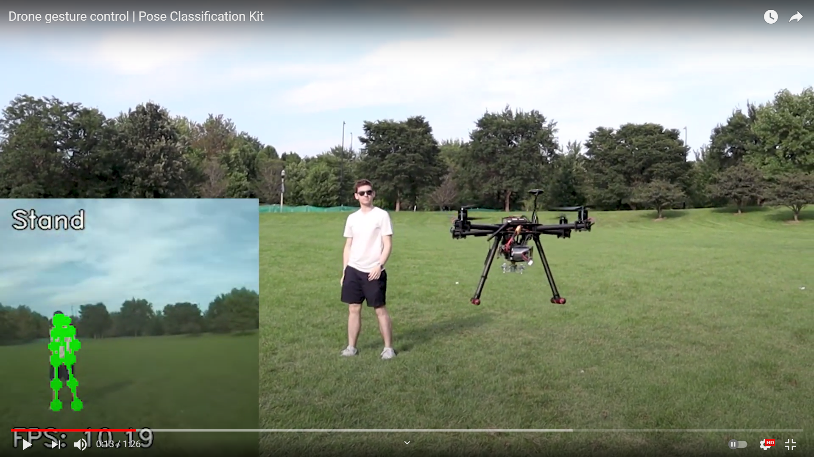
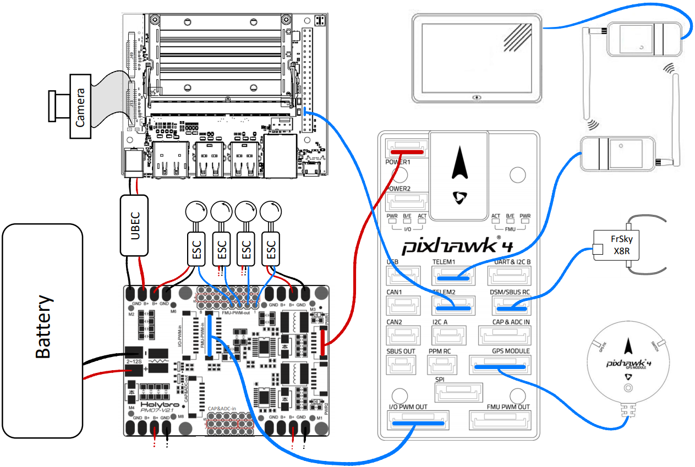
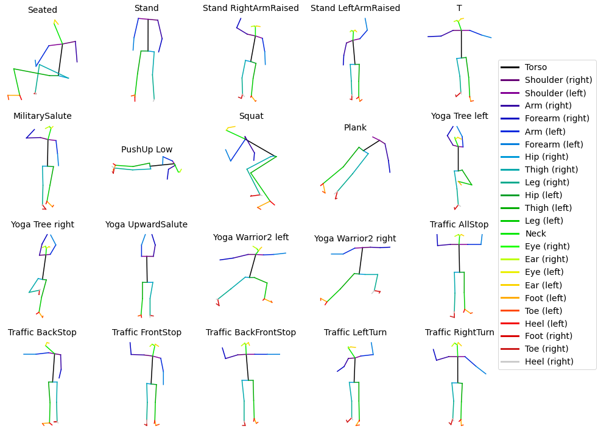

<h1 align = "center"> Gesture Controlled Drone </h1>

[![MIT License][license-shield]][license-url]
[![LinkedIn][linkedin-shield]][linkedin-url]

<p align="center">
    
</p>

This project leverages the Jetson Nano's computational capabilities to augment a drone with computer vision capabilities and allow gesture control. The deep learning model deployed here is part of a larger project, a [**Pose Classification Kit**](https://github.com/ArthurFDLR/pose-classification-kit), focusing on pose estimation/classification applications toward new human-machine interfaces.

- [Demonstration & Processing pipeline description](#demonstration--processing-pipeline-description)
- [Getting Started](#getting-started)
  - [Step 1 - Install Dependencies](#step-1---install-dependencies)
  - [Step 2 - Install the gesture control pipeline](#step-2---install-the-gesture-control-pipeline)
  - [Step 3 - Hardware setup](#step-3---hardware-setup)
  - [Step 4 - Launch the system](#step-4---launch-the-system)
- [Usage](#usage)
- [License](#license)
- [Acknowledgments](#acknowledgments)

## Demonstration & Processing pipeline description

<a href="https://youtu.be/FZAUPmKiSXg"><p align="center">
    
</p></a>

<p align="center">
    
</p>

## Getting Started

### Step 1 - Install Dependencies

1. Install PyTorch and Torchvision - see [PyTorch for Jetson Nano](https://forums.developer.nvidia.com/t/pytorch-for-jetson-version-1-9-0-now-available/72048).
2. Install TensorFlow - see [Installing TensorFlow For Jetson Platform](https://docs.nvidia.com/deeplearning/frameworks/install-tf-jetson-platform/index.html). Note that TensorFlow is already installed on JetPack.
3. Install [torch2trt](https://github.com/NVIDIA-AI-IOT/torch2trt)
    ```
    git clone https://github.com/NVIDIA-AI-IOT/torch2trt
    cd torch2trt
    sudo python3 setup.py install --plugins
    ```
4. Install other miscellaneous packages
    ```
    sudo pip3 install numpy Pillow pymavlink dronekit 
    ```


### Step 2 - Install the gesture control pipeline

1. Clone this repository on your Jetson Nano
    ```
    git clone https://github.com/ArthurFDLR/drone-gesture-control
    cd drone-gesture-control
    ```
2. Download and place the TensorRT-Pose pre-trained model [resnet18_baseline_att_224x224_A_epoch_249.pth](https://drive.google.com/file/d/1XYDdCUdiF2xxx4rznmLb62SdOUZuoNbd/view) in the folder [`.\drone-gesture-control\models`](.\drone-gesture-control\models)
3. Run the installation procedure. This operation can take a while.
    ```
    sudo python3 install.py
    ```

### Step 3 - Hardware setup 

1. Wire the UART ports _D15 (RX) - D14 (TX)_ on the _J41_ expansion header pins of the carrier board of the Jetson Nano to a MAVLink enabled serial port on your flight controller. See bellow a setup example using the Pixhawk 4 flight controller. The default baud rate is 57600.
<p align="center">
    
</p>

2. Disable the Serial Console trigger on the serial connection - see [Jetson Nano – UART](https://www.jetsonhacks.com/2019/10/10/jetson-nano-uart/).
    ```
    systemctl stop nvgetty
    systemctl disable nvgetty
    udevadm trigger
    ```

3. Connect your camera to the CSI port 0. You might have to adapt the GStreamer pipeline for your camera - see `gstream_pipeline` in [`.\drone-gesture-control\__main__.py`](.\drone-gesture-control\__main__.py). The camera used for development is an Arducam IMX477 mini.

### Step 4 - Launch the system
```
python3 drone-gesture-control
```

<!-- USAGE EXAMPLES -->
## Usage

The gesture control system currently supports only basics - yet essential - commands:
- _T_: Arm the drone if it is disarmed and landed; Disarm the drone if it is armed and landed.
- _Traffic\_AllStop_: Take-off at an altitude of 1.8m if the drone is armed and landed; Land if the drone is in flight.
- _Traffic\_RightTurn_: Move 4m to the right if the drone is armed.
- _Traffic\_LeftTurn_: Move 4m to the left if the drone is armed.
- _Traffic\_BackFrontStop_: Move 2m backward if the drone is armed.
- _Traffic\_FrontStop_: Move 2m forward if the drone is armed.
- _Yoga\_UpwardSalute_: Return to Launch (RTL).

<p align="center">
    
</p>

For security purposes, the system only transmits orders to the flight controller if it is in _GUIDED_ mode. We recommend binding a switch of your radio controller to select this mode for ease of use. 

<!-- LICENSE -->
## License

Distributed under the MIT License. See [`LICENSE`](https://github.com/ArthurFDLR/drone-gesture-control/blob/main/LICENSE) for more information.

## Acknowledgments

Many thanks to the [ECASP Laboratory](http://ecasp.ece.iit.edu/) from the Illinois Institute of Technology that has provided all the  necessary hardware to develop this project.

<!-- MARKDOWN LINKS & IMAGES -->
[license-shield]: https://img.shields.io/github/license/ArthurFDLR/drone-gesture-control?style=for-the-badge
[license-url]: https://github.com/ArthurFDLR/drone-gesture-control/blob/master/LICENSE
[linkedin-shield]: https://img.shields.io/badge/-LinkedIn-black.svg?style=for-the-badge&logo=linkedin&colorB=555
[linkedin-url]: https://linkedin.com/in/arthurfdlr/